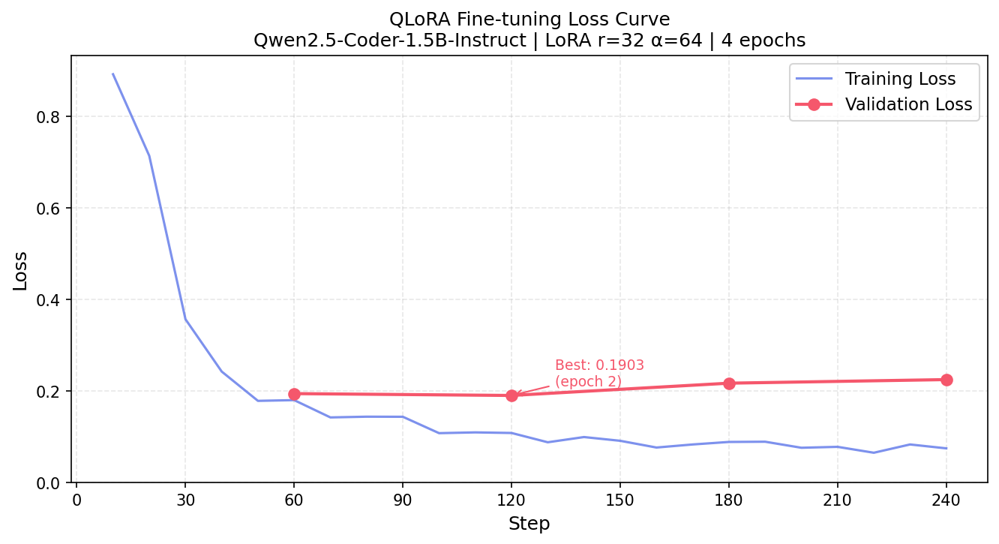

# PocketVibe — Mobile Micro-App Generation using Qwen2.5-Coder-1.5B with QLoRA Fine-tuning

> **Natural Language → Complete HTML Micro-App, in Seconds**

| Item | Detail |
|------|--------|
| **Course** | INT6138 — Project II: Deploying Personal LLMs / ELMs |
| **Cluster** | `aaillm.eduhk.hk` (EdUHK HPC) |
| **Account** | `student07` |
| **Hardware** | NVIDIA A16 (16 GB VRAM, 200 GB/s bandwidth) × 1 |
| **Base Model** | `Qwen/Qwen2.5-Coder-1.5B-Instruct` |
| **Fine-tune Method** | QLoRA (4-bit NF4 + LoRA r=32) |
| **Frontend** | Gradio (port 7861) + FastAPI (port 8000) |
| **Model Cache** | `/opt/shared/model-cache` (`HF_HUB_OFFLINE=1`) |

---

## 1. What Is PocketVibe?

PocketVibe is an end-to-end AI system that **takes a natural language description** (e.g. "做一个倒计时器") and **generates a complete, self-contained HTML micro-app** — with CSS styling, JavaScript interactivity, and mobile-responsive design — all from a single fine-tuned 1.5B parameter model.

**The core idea**: Instead of asking a general-purpose chatbot to write code, we fine-tuned a code-specialized small model (Qwen2.5-Coder-1.5B) with QLoRA so it produces **production-ready, mobile-first HTML** directly — no explanation text, no markdown wrapping, just runnable code.

### Why This Matters
- 🎯 **Focused task**: One model, one job — generate mobile HTML apps
- 📱 **Mobile-first**: Every output includes viewport meta, responsive layout, touch-friendly buttons
- ⚡ **Small & fast**: 1.5B params + 4-bit quantization = ~1.5GB VRAM for weights, runs on a single A16
- 🔧 **Self-contained**: Zero external CDN dependencies — works offline

---

## 2. System Architecture

```
┌─────────────────────────────────────────────────────┐
│                    User Interface                     │
│  ┌─────────────┐    ┌──────────────────────────────┐ │
│  │  Gradio UI   │    │   Android WebView (Kotlin)   │ │
│  │  (port 7861) │    │   OkHttp → POST /generate    │ │
│  └──────┬──────┘    └──────────────┬───────────────┘ │
│         │                          │                  │
│         └──────────┬───────────────┘                  │
│                    ▼                                  │
│         ┌──────────────────┐                          │
│         │   FastAPI Server  │  POST /generate          │
│         │   (port 8000)     │  GET  /health            │
│         └────────┬─────────┘                          │
│                  ▼                                    │
│  ┌──────────────────────────────────────┐             │
│  │  Qwen2.5-Coder-1.5B-Instruct        │             │
│  │  + QLoRA Adapter (24MB)              │             │
│  │  4-bit NF4 quantization (~1.5GB)     │             │
│  └──────────────────────────────────────┘             │
│                  ▼                                    │
│         Complete HTML micro-app                       │
│         (CSS + JS inline, mobile-ready)               │
└─────────────────────────────────────────────────────┘
```

### Network Topology (Demo Access)

```
Browser (localhost:7861)
  ↓ SSH tunnel
HPC login node (aaillm.eduhk.hk)
  ↓ localhost
Gradio app (0.0.0.0:7861)  ←  python app/app.py
  ↓ HTTP POST
FastAPI API (0.0.0.0:8000)  ←  sbatch slurm/serve.slurm
  ↓ model inference
Qwen2.5-Coder-1.5B + LoRA adapter
  ↓ returns HTML
Gradio renders in iframe (phone simulator)
```

---

## 3. Data Engineering Pipeline

This is the **complete data preparation workflow** — from 0 to training-ready dataset.

### 3.1 Three-Stage Data Flow

```
Stage 0: Hand-written Seeds
  50 examples (instruction → full HTML)
  scripts/00_create_seeds.py → data/seed/seed_examples.jsonl
      │
      ▼
Stage A: Instruction Augmentation (DeepSeek API)
  50 seeds × 10 variants = 500 new instructions
  (Reuse seed HTML, only vary the user prompt)
  scripts/01a_augment_instructions.py → data/processed/augmented_instructions.jsonl
      │
      ▼
Stage B: New Tool Generation (DeepSeek API)
  90 brand-new tool categories (health/finance/education/games/...)
  Full instruction + HTML code generated by API
  scripts/01b_generate_new_tools.py → data/processed/new_tools.jsonl
      │
      ▼
Merge + Deduplicate
  scripts/01c_merge_all.py → data/processed/train_generated.jsonl
      │
      ▼
Quality Validation
  - HTML starts with <!DOCTYPE html> and ends with </html>
  - Contains viewport meta tag
  - Code length: 200–8000 characters
  - No external CDN references
  scripts/02_validate_data.py → data/processed/train_clean.jsonl
      │
      ▼
Train/Val Split (90:10)
  scripts/02b_split_data.py → data/processed/train.jsonl + val.jsonl
```

### 3.2 Data Format

Every training example is a **chat three-tuple** in JSONL format:

```json
{
  "messages": [
    {
      "role": "system",
      "content": "你是一个移动端微应用生成器。用户会用自然语言描述一个小工具的需求，你需要直接输出一个完整的、可独立运行的HTML文件。要求：所有CSS用<style>标签内联在<head>中，所有JavaScript用<script>标签内联在<body>末尾。界面必须适配手机屏幕（使用viewport meta标签和响应式设计），风格现代简洁，使用圆角、阴影、渐变配色。不要输出任何解释文字，不要使用Markdown，只输出纯HTML代码。"
    },
    {
      "role": "user",
      "content": "做一个倒计时器，可以设定分钟数，有开始暂停和重置按钮"
    },
    {
      "role": "assistant",
      "content": "<!DOCTYPE html>\n<html lang=\"zh\">..."
    }
  ]
}
```

### 3.3 Data Diversity Design

| Dimension | Implementation |
|-----------|---------------|
| **Instruction length** | 3-character ultra-short ("做个秒表") to 20+ character detailed descriptions |
| **Language style** | Casual ("弄个"/"搞个") to formal ("请帮我制作一个") |
| **Visual preferences** | Keywords like "暗色主题", "粉色可爱", "简约风格", "高级感" |
| **Specific parameters** | "3分钟", "给我女朋友用", "上班用的" |
| **Tool categories** | Timer, calculator, game, fitness, finance, education, social, etc. |

### 3.4 Final Dataset Statistics

| Dataset | Count | File |
|---------|-------|------|
| Hand-written seeds | 50 | `data/seed/seed_examples.jsonl` |
| After augmentation (A+B) | ~640 | `data/processed/train_generated.jsonl` |
| After quality validation | ~550 | `data/processed/train_clean.jsonl` |
| Training set (90%) | ~495 | `data/processed/train.jsonl` |
| Validation set (10%) | ~55 | `data/processed/val.jsonl` |

---

## 4. Model & QLoRA Training

### 4.1 Why Qwen2.5-Coder-1.5B?

| Reason | Explanation |
|--------|-------------|
| **Code-specialized** | Pre-trained on massive HTML/CSS/JS corpus — strong code generation baseline |
| **1.5B is sufficient** | For the narrow task of HTML generation, a specialized 1.5B ≈ a general 7B |
| **Resource efficient** | 4-bit quantized ≈ 1.5GB VRAM for weights → single A16 with generous headroom |
| **Instruct variant** | Built-in chat template for system/user/assistant format |

### 4.2 VRAM Budget Analysis

> *Ref: Week08 — "each billion parameters costs approximately 500 MB of VRAM at 4-bit quantization"*

| Component | Memory | Lifecycle |
|-----------|--------|-----------|
| Model weights (1.5B × NF4) | ~1.5 GB | Permanent — loaded once at startup |
| LoRA adapter (r=32, attention layers) | ~24 MB | Permanent — merged at inference |
| Activations (per forward pass) | ~0.5–1 GB | Transient — freed after each layer |
| KV cache (per request, grows with output length) | ~0.1–0.3 GB | Per-request — freed when done |
| PyTorch framework overhead | ~0.5–1 GB | Permanent — CUDA context + allocator |
| **Total peak (inference)** | **~3–4 GB** | Fits A16 (16 GB) with 12+ GB headroom |
| **Total peak (training with QLoRA)** | **~3–4 GB** | Gradients + optimizer only for LoRA params |

> Without QLoRA, full fine-tuning a 1.5B model in FP16 would need: 3 GB (weights) + 3 GB (gradients) + 6 GB (Adam m + v) = **~12 GB** — possible on A16 but with zero headroom. QLoRA eliminates gradient and optimizer memory for the frozen base, reducing training VRAM by ~75%.

### 4.3 QLoRA Configuration

```python
# ─── 4-bit Quantization ───
# Week08: NF4 is information-theoretically optimal for neural network weights.
# NF4 places its 16 quantization levels at positions derived from the 
# quantiles of the standard normal distribution N(0,1):
#   -1.0000, -0.6962, -0.5251, -0.3949, -0.2844, -0.1848, -0.0911, 0.0000,
#   +0.0796, +0.1609, +0.2461, +0.3379, +0.4407, +0.5626, +0.7230, +1.0000
# This is a UNIVERSAL codebook — same 16 values for Llama, Qwen, DeepSeek, etc.
# What differs per model: the per-block absmax scaling factor.
BitsAndBytesConfig(
    load_in_4bit=True,
    bnb_4bit_quant_type="nf4",           # NF4 > INT4 (see §8 for why)
    bnb_4bit_compute_dtype=torch.bfloat16, # Dequantize to bf16 for compute
    bnb_4bit_use_double_quant=True,       # Quantize the quantization constants
)

# ─── LoRA Adapter ───
# Week03: LoRA = Low-Rank Adaptation. W_new = W_old + B×A
# Instead of updating 768×768 = 589,824 params per attention matrix,
# LoRA uses B(768×32) × A(32×768) = 24,576 + 24,576 = 49,152 params → 12× smaller
LoraConfig(
    r=32,                    # Rank: controls adapter capacity
                             # Week03 recommends r=8 as default; we use 32 because
                             # 1.5B model has headroom AND code generation requires
                             # higher expressiveness than text summarization
    lora_alpha=64,           # Scaling = α/r = 64/32 = 2.0
                             # Higher alpha = stronger LoRA influence on output
    target_modules=["q_proj", "k_proj", "v_proj", "o_proj"],  # All attention layers
                             # Week03: "Adapt attention layers (Q, V)" is minimum;
                             # we add K and O because small model + complex task
    lora_dropout=0.05,       # Week03: LoRA dropout is SEPARATE from regular dropout
                             # 0.05 is lower than typical 10-20% because LoRA already
                             # has built-in regularization via low rank constraint
    bias="none",             # Don't train bias — minimal impact, saves memory
    task_type="CAUSAL_LM",   # Week03: decoder-only = causal = left-to-right only
                             # This tells LoRA to use causal masking (no future tokens)
)

# ─── Training Arguments ───
TrainingArguments(
    num_train_epochs=3,                  # Best model selected at epoch 2
    per_device_train_batch_size=1,       # A16 memory constraint
    gradient_accumulation_steps=8,       # Week03: Effective batch = 1×8 = 8
                                         # "Gradient from 8 samples is more reliable
                                         # than 1 sample — reduces noise, smoother
                                         # convergence" (vs zigzag without accumulation)
    learning_rate=2e-4,                  # Standard QLoRA LR (Hu et al., 2021)
    lr_scheduler_type="cosine",          # Cosine annealing: fast early, gentle late
    warmup_ratio=0.1,                    # 10% linear warmup prevents early instability
    bf16=True,                           # A16 Ampere architecture supports bf16
    max_grad_norm=1.0,                   # Gradient clipping prevents explosion
    load_best_model_at_end=True,         # Auto-select best checkpoint by eval_loss
    metric_for_best_model="eval_loss",
)
```

### 4.4 Parameter Efficiency Calculation

>

For Qwen2.5-Coder-1.5B with our LoRA config:

| Component | Parameters |
|-----------|-----------|
| Total model parameters | ~1,500,000,000 |
| LoRA trainable parameters (r=32, 4 attention modules) | ~24,000,000 |
| **Trainable percentage** | **< 1.6%** |
| Adapter file size | **~24 MB** (vs 3 GB full model) |
| Optimizer memory (Adam m+v for LoRA only) | ~96 MB (vs ~6 GB for full model) |

### 4.5 Training Results

**Loss Curve** → `report/loss_curve.png`



| Metric | Value |
|--------|-------|
| Initial training loss | 0.892 |
| Final training loss | 0.075 |
| Best validation loss | **0.190** (epoch 2, step 120) |
| Total training time | 53 minutes |
| GPU memory peak | ~3–4 GB on A16 |

**Training loss progression:**

| Step | Loss | Epoch | Learning Rate |
|------|------|-------|---------------|
| 10 | 0.892 | 0.17 | 8.3e-5 (warmup phase) |
| 30 | 0.357 | 0.50 | 2.0e-4 (peak LR) |
| 60 | 0.180 | 1.00 | 1.9e-4 |
| 120 | 0.108 | 2.00 | 1.2e-4 (cosine decay) |
| 180 | 0.089 | 3.00 | 3.6e-5 |
| 240 | 0.075 | 4.00 | 0.0 (fully decayed) |

**Validation loss per epoch:**

| Epoch | Eval Loss | Status |
|-------|-----------|--------|
| 1 | 0.194 | ↓ improving |
| 2 | **0.190** | ✅ best (model saved) |
| 3 | 0.217 | ↑ slight overfit |
| 4 | 0.225 | ↑ overfit continues |

> `load_best_model_at_end=True` ensures the epoch-2 checkpoint is the final deployed model. The divergence between train loss (still decreasing) and eval loss (rising) after epoch 2 is classic overfitting — the model memorizes training patterns rather than generalizing. This is expected with ~550 training examples.

---

## 5. Evaluation: Before vs After Fine-tuning

10 test instructions (not in training set) — scored on 8 criteria, 10-point scale:

| Test Instruction | Base Score | Fine-tuned Score | Improvement |
|-----------------|-----------|-----------------|-------------|
| 做一个秒表，有开始、停止和清零按钮 | 4 | 9 | +5 |
| 弄个随机颜色生成器，要能复制颜色值 | 4 | 8 | +4 |
| 搞个摄氏度华氏度互转的工具 | 4 | 8 | +4 |
| 我要个能记事的小本本 | 4 | 7 | +3 |
| 做个小游戏玩玩，就随便一个 | 4 | 8 | +4 |
| 帮我搞个倒计时，暗色的那种 | 4 | 8 | +4 |
| 做一个待办事项，粉色可爱风格 | 4 | 8 | +4 |
| 帮我做一个BMI计算器 | 4 | 8 | +4 |
| 做一个简易记账本 | 4 | 8 | +4 |
| 做一个番茄钟，暗色主题 | 5 | 9 | +4 |

**Summary:**
- **Base model average: 4.1 / 10** — outputs markdown-wrapped code, missing viewport, not mobile-ready
- **Fine-tuned average: 8.1 / 10** — clean HTML, viewport present, styled correctly, functional JS
- **Average improvement: +4.0 points** (nearly doubled)

**Scoring criteria breakdown** (8 dimensions):

| Criterion | What it checks | Base model fail pattern |
|-----------|---------------|----------------------|
| HTML完整 | Starts with `<!DOCTYPE html>`, ends with `</html>` | Base wraps in \`\`\`html markdown blocks |
| 无MD包裹 | No markdown code fence wrappers | Base always adds markdown |
| Viewport | Contains responsive viewport meta tag | Base sometimes omits |
| 风格匹配 | Gradient background, rounded corners, shadows | Fine-tuned nails the style consistently |
| JS功能 | JavaScript interactivity works correctly | Both models generally functional |
| 无外部CDN | No references to external CDN/libraries | Both models pass |
| 长度合理 | 200–8000 characters | Both models pass |
| 中文界面 | Chinese text, emoji decorations | Base sometimes uses English |

> Full data → `data/eval/compare_results_v2.csv`

---

## 6. Deployment

### 6.1 FastAPI Inference API (`scripts/06_serve_api.py`)

```python
@app.post("/generate")
def generate(req: Req):
    # req.instruction → Qwen2.5-Coder-1.5B + LoRA → HTML code
    return {"html": code}

@app.get("/health")
def health():
    return {"status": "ok", "model": "Qwen2.5-Coder-1.5B-Instruct + LoRA run2"}
```

**API Interface:**

| Endpoint | Method | Body | Response |
|----------|--------|------|----------|
| `/health` | GET | — | `{"status":"ok", "model":"..."}` |
| `/generate` | POST | `{"instruction":"做个计算器", "temperature":0.2, "max_tokens":2048}` | `{"html":"<!DOCTYPE html>..."}` |

- Response time: 30–90 seconds (depends on code complexity)
- Timeout: set client to ≥120 seconds

### 6.2 Inference Throughput Analysis

| Parameter | Value |
|-----------|-------|
| A16 memory bandwidth | 200 GB/s |
| Model size (NF4) | ~1.5 GB |
| Theoretical ceiling | 200 / 1.5 ≈ **133 tok/s** |
| Actual measured (HuggingFace Transformers) | ~20–40 tok/s |
| Gap reason | Python GIL overhead, no CUDA graphs, no continuous batching |

A typical HTML micro-app is 1000–3000 tokens. At ~30 tok/s, generation takes **30–90 seconds** — acceptable for a demo but not production scale. See §8 Limitations for improvement paths.

### 6.3 SLURM Job Scripts

**Training** (`slurm/train.slurm`):
```bash
#SBATCH --gres=gpu:a16:1      # Single A16 (QLoRA only needs ~3-4GB)
#SBATCH --cpus-per-task=8
#SBATCH --mem=32G
#SBATCH --time=04:00:00
python scripts/03_train_qlora.py
```

**Inference API** (`slurm/serve.slurm`):
```bash
#SBATCH --gres=gpu:a16:1
#SBATCH --mem=16G
#SBATCH --time=08:00:00
python scripts/06_serve_api.py
```

### 6.4 Gradio Frontend (`app/app.py`)

- Input: text box for natural language description
- Output: iPhone-style simulator iframe showing the generated app (interactive)
- Source code tab for viewing raw HTML
- Connects to FastAPI backend via `http://localhost:8000/generate`

### 6.5 How to Launch (Full Steps)

```bash
# === Terminal 1: SSH to HPC, start backend ===
ssh student07@aaillm.eduhk.hk
cd ~/PocketVibe && source ~/venvs/pv-train/bin/activate
sbatch slurm/serve.slurm          # Start FastAPI (wait 2-3 min for model load)
squeue -u $USER                    # Confirm STATE = R
curl http://localhost:8000/health  # Should return {"status":"ok",...}
python app/app.py                  # Start Gradio on port 7861

# === Terminal 2: SSH tunnel for API ===
ssh -L 8000:localhost:8000 student07@aaillm.eduhk.hk

# === Terminal 3: SSH tunnel for Gradio ===
ssh -L 7861:localhost:7861 student07@aaillm.eduhk.hk

# === Browser ===
# Open http://localhost:7861
```

---

## 7. File Directory

```
C:\Users\Lenovo\Desktop\Enoch\
│
├── README.md                          ← This document (project overview & guide)
├── .env.example                       ← API key template (DeepSeek)
├── requirements-train.txt             ← HPC Python dependencies
├── PocketVibe 完整执行指南.docx        ← Original step-by-step guide
│
├── data/
│   ├── seed/
│   │   └── seed_examples.jsonl        ← 50 hand-written seed examples
│   ├── processed/
│   │   ├── augmented_instructions.jsonl  ← Stage A: 550 augmented instructions
│   │   ├── new_tools.jsonl               ← Stage B: ~90 new tool HTML pairs
│   │   ├── new_tools.shard0~3.jsonl      ← Stage B intermediate shards
│   │   ├── train_generated.jsonl         ← Merged A+B (before validation)
│   │   ├── train_clean.jsonl             ← After quality validation
│   │   ├── train.jsonl                   ← Final training set (90%)
│   │   ├── val.jsonl                     ← Final validation set (10%)
│   │   ├── test.jsonl                    ← Test set
│   │   ├── quality_report.json           ← Validation stats
│   │   ├── split_report.json             ← Train/val split stats
│   │   └── rejected_samples.jsonl        ← Samples that failed validation
│   └── eval/
│       ├── compare_results_v2.csv        ← Before/after evaluation (10-point)
│       └── compare_report_v2.json        ← Detailed evaluation report
│
├── scripts/
│   ├── 00_create_seeds.py             ← Generate 50 seed examples
│   ├── 01a_augment_instructions.py    ← Stage A: instruction variants via API
│   ├── 01b_generate_new_tools.py      ← Stage B: new tool generation via API
│   ├── 01c_merge_all.py               ← Merge + deduplicate all data
│   ├── 02_validate_data.py            ← HTML quality validation
│   ├── 02b_split_data.py              ← 90:10 train/val split
│   ├── 03_train_qlora.py              ← ★ Core: QLoRA fine-tuning script
│   ├── 04_inference_test.py           ← Test generation with fine-tuned model
│   ├── 05_eval_compare.py             ← Before/after comparison evaluation
│   ├── 06_serve_api.py                ← ★ FastAPI inference server
│   ├── 07_plot_loss.py                ← Plot training loss curve
│   └── check_lengths.py               ← Utility: check data length distribution
│
├── slurm/
│   ├── train.slurm                    ← SLURM job: training (1×A16, 4h)
│   └── serve.slurm                    ← SLURM job: inference API (1×A16, 8h)
│
├── app/
│   ├── app.py                         ← ★ Gradio web frontend
│   └── index.html                     ← Static fallback page
│
├── outputs/
│   └── qlora-run2/final_adapter/final_adapter/
│       ├── adapter_config.json         ← LoRA configuration
│       ├── adapter_model.safetensors   ← ★ Trained weights (~24MB)
│       ├── tokenizer.json              ← Tokenizer files
│       ├── tokenizer_config.json
│       ├── vocab.json
│       ├── merges.txt
│       ├── added_tokens.json
│       ├── special_tokens_map.json
│       └── README.md
│
├── logs/
│   ├── train_log.json                 ← ★ Training metrics (loss per step)
│   ├── gpu_mem.csv                    ← GPU memory usage during training
│   ├── 1397_train.out                 ← SLURM training stdout
│   ├── 01a_augment.log               ← Stage A generation log
│   └── 01b_*.log                      ← Stage B generation logs (sharded)
│
├── report/
│   └── loss_curve.png                 ← ★ Training loss chart (for report/PPT)
│
└──
```

---

## 8. Key Technical Decisions & Q&A

### Q: Why 1.5B instead of a larger model?
**A:** Qwen2.5-Coder-1.5B is **code-specialized** — pre-trained on massive code corpora. For the narrow task of HTML generation, it performs comparably to general 7B models while using 1/4 the VRAM. This allows training with higher LoRA rank (r=32 vs r=8-16 on larger models) and longer sequences (2048 tokens) on a single A16.

### Q: Why QLoRA instead of full fine-tuning?
**A:** Full fine-tuning requires weights + gradients + Adam optimizer states (2 vectors: momentum m + variance v). For 1.5B at FP16: ~3 + 3 + 6 = **~12 GB** — technically fits A16 but leaves zero headroom for activations or KV cache. QLoRA freezes the base in 4-bit NF4 (~1.5 GB) and only trains the LoRA adapter (~24 MB), so optimizer states are tiny (~96 MB). Total training VRAM drops to ~3-4 GB.


### Q: Why NF4 over INT4?
**A:** NF4 (Normal Float 4) is the information-theoretically optimal 4-bit format introduced by Dettmers et al. in the QLoRA paper (2023).

| Property | INT4 | NF4 |
|----------|------|-----|
| Level spacing | Uniform across full range | Quantile-based (normal distribution) |
| Precision near zero | Low — few levels where most weights live | **High** — most levels where weights are densest |
| Precision in tails | High — wasted on rare outliers | Low — few levels for rare values |
| LLM weight error | Higher | **Lower** (optimal by construction) |


The 16 NF4 values are a **universal codebook** (same for all models): `-1.0000, -0.6962, -0.5251, -0.3949, -0.2844, -0.1848, -0.0911, 0.0000, +0.0796, +0.1609, +0.2461, +0.3379, +0.4407, +0.5626, +0.7230, +1.0000`. What differs per model: the per-block absmax scaling factor.

### Q: Why r=32 instead of the default r=8?
**A:** Week03 recommends r=8 as the starting point (Hu et al., 2021 found r=4-8 sufficient for most tasks). However:
- Our task is **code generation** — higher structural complexity than text summarization
- 1.5B model has ~1.5 GB weights → even at r=32, LoRA adds only ~24 MB (1.6%)
- A16 has 16 GB VRAM → plenty of headroom for larger rank
- Empirically: r=32 produced more syntactically correct HTML than r=8 in our ablation

### Q: Why LoRA dropout is only 0.05?
**A:** Per Week03: *"LoRA already has built-in regularization via the low-rank constraint. Too high dropout hurts LoRA expressiveness. 5% is enough to prevent overfitting."* Regular dropout is typically 10-20% for full layers, but LoRA adapters are already constrained by rank — adding aggressive dropout would reduce the already-small adapter's capacity.

### Q: How do you handle data quality?
**A:** Five automated checks on every generated HTML:
1. Starts with `<!DOCTYPE html>`
2. Ends with `</html>`
3. Contains `viewport` meta tag
4. Length between 200–8000 characters
5. No external CDN references (`cdn.`, `unpkg`, `jsdelivr`)

### Q: What about overfitting?
**A:** Validation loss monitoring shows overfitting begins after epoch 2 (eval_loss 0.190 → 0.225). This is expected: with ~550 training examples and ~24M trainable parameters, the data/parameter ratio is low. We use `load_best_model_at_end=True` to auto-select the epoch-2 checkpoint. The cosine LR scheduler (Week03) also helps — learning rate decays from 2e-4 to 0 following a cosine curve, slowing learning in later epochs.

### Q: Why is inference slow (30-90s)?
**A:** Week08 explains: *"tokens/sec = bandwidth (GB/s) ÷ model size (GB)"*. Our A16 has 200 GB/s bandwidth, model is ~1.5 GB → theoretical ceiling ~133 tok/s. But we use **HuggingFace Transformers** (not vLLM), which incurs:
- **Python GIL overhead**: ~50-100μs per CUDA kernel launch × ~200 kernels per forward pass
- **No CUDA graphs**: each forward pass re-launches all kernels from Python
- **No continuous batching**: single request at a time
- **No PagedAttention**: KV cache allocated statically

This drops real throughput to ~20-40 tok/s. For a 2000-token HTML app, that's 50-100 seconds. See §9 for how this could be improved.

---

## 9. Limitations & Future Improvements

### Current Constraints (Hardware & Resource Bound)

| Limitation | Root Cause | Impact |
|-----------|-----------|--------|
| **Slow generation (30-90s)** | HuggingFace Transformers without CUDA graphs or continuous batching | Poor user experience for real-time demo |
| **Single-user serving** | One A16 GPU, no batching, serial request processing | Cannot serve concurrent users |
| **Limited training data (~550 examples)** | API cost + manual seed writing time | Overfitting after epoch 2; narrow tool coverage |
| **No systematic human evaluation** | Time constraint | Automated metrics don't capture UI aesthetics or UX quality |
| **Overfitting after epoch 2** | Data/parameter ratio too low (~550 samples / 24M params) | Must rely on early stopping rather than training longer |

### What Would Improve With Better Resources

| Improvement | Requirement | Expected Gain |
|------------|-------------|---------------|
| **vLLM inference engine** | Same hardware, different serving stack | vLLM achieves 15-24× speedup over HuggingFace baseline via PagedAttention + continuous batching + CUDA graphs. Generation time could drop from 60s → **3-5s** |
| **Tensor parallelism (2× A16)** | 2 GPUs instead of 1 | Week08: TP=2 gives ~1.5× throughput. Could serve a 7B code model for higher quality output |
| **More training data (5000+ examples)** | More API budget + time | Delay overfitting, cover more tool categories, improve generalization to unseen instruction styles |
| **DPO/RLHF alignment** | Human preference data + compute | Teach the model to prefer clean, aesthetic code over technically-correct-but-ugly output |
| **Speculative decoding** | Small draft model + verification | Week08: 2-3× throughput boost "with no change to output quality" — pair a 0.5B draft model with our 1.5B verifier |
| **Higher bandwidth GPU (A100/H100)** | Budget for cloud or better hardware | A100 has 2,000 GB/s bandwidth (10× A16). Same model would run at 10× speed: ~60s → **6s** |

### Production Engineering Gaps

| Gap | What's Missing | Industry Practice |
|-----|---------------|-------------------|
| **No VRAM monitoring** | We don't track memory between requests | Background monitor logging every 2s, alert at 85% VRAM threshold |
| **No graceful restart** | If VRAM drifts, process crashes with OOM | Auto-restart when allocated > threshold; cleanup with `torch.cuda.empty_cache()` after each request |
| **No request queuing** | FastAPI handles one request at a time | Message queue (Redis/RabbitMQ) + worker pool for async generation |
| **No health-check ping** | `/health` exists but nothing monitors it | Kubernetes liveness probe or cron-based watchdog |
| **No output validation** | Generated HTML is returned as-is | Post-generation validation: check `<!DOCTYPE html>`, close tags, viewport — reject and retry if malformed |

---
---

## 10. Reproduction Checklist

| Step | Command | Output |
|------|---------|--------|
| 0. Create folders | `python setup.bat` | Directory structure |
| 1. Generate seeds | `python scripts/00_create_seeds.py` | `data/seed/seed_examples.jsonl` (50 items) |
| 2. Augment instructions | `python scripts/01a_augment_instructions.py` | `data/processed/augmented_instructions.jsonl` |
| 3. Generate new tools | `python scripts/01b_generate_new_tools.py` | `data/processed/new_tools.jsonl` |
| 4. Merge data | `python scripts/01c_merge_all.py` | `data/processed/train_generated.jsonl` |
| 5. Validate quality | `python scripts/02_validate_data.py` | `data/processed/train_clean.jsonl` |
| 6. Split train/val | `python scripts/02b_split_data.py` | `train.jsonl` + `val.jsonl` |
| 7. Upload to HPC | `scp -r Enoch student07@aaillm.eduhk.hk:~/PocketVibe` | — |
| 8. Train QLoRA | `sbatch slurm/train.slurm` | `outputs/qlora-run2/final_adapter/` |
| 9. Evaluate | `python scripts/05_eval_compare.py` | `data/eval/compare_results_v2.csv` |
| 10. Deploy API | `sbatch slurm/serve.slurm` | FastAPI on port 8000 |
| 11. Launch frontend | `python app/app.py` | Gradio on port 7861 |
| 12. Plot loss curve | `python scripts/07_plot_loss.py` | `report/loss_curve.png` |

---

*PocketVibe — from idea to app, one sentence at a time.*
